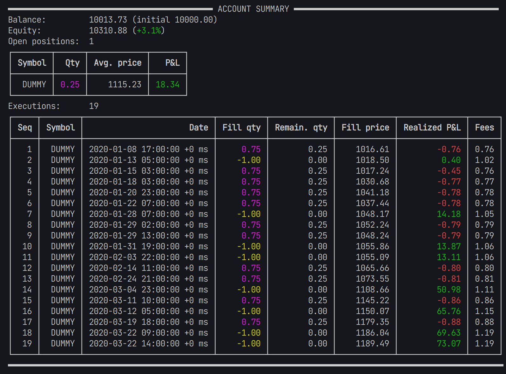
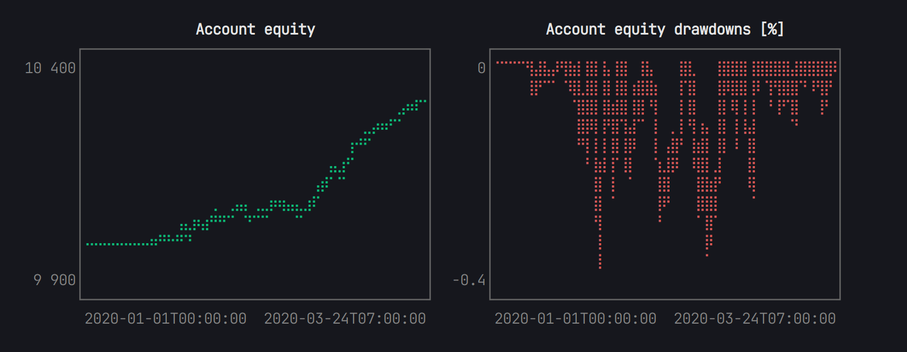

# Fastback.jl - Blazing fast Julia backtester 🚀

[](./LICENSE)


Fastback provides a lightweight, flexible and highly efficient event-based backtesting framework for quantitative trading strategies.

Fastback does not try to model every aspect of a trading system, e.g. brokers, data sources, logging etc., but rather provides basic building blocks to create a custom backtesting environment that is easy to understand and extend.

The event-based architecture aims to mimic the way a real-world trading systems works, where new data is ingested as a continuous data stream, i.e. events. This reduces the implementation gap from backtesting to real-world execution significantly compared to a vectorized backtesting frameworks.

## Features

- Event-based
- Modular architecture, no opinionated black-box design
- Supports arbitrary pricing data source
- Supports modelling fees, execution delays, price slippage and partial fills
- Flexible data collectors to collect time series like account equitity history, number of open positions, etc.
- Facilities for parallelized backtesting and hyperparameter optimization
- Uses position netting approach for bookkeeping
  - Maintains single position per instrument using weighted average cost method

## Example

Code file, see [examples/random_trading.jl](examples/random_trading.jl).

### Code

```julia
# Random trading strategy example
# -------------------------------
# This dummy example demonstrates how to backtest a simple random trading strategy
# using synthetic data generated in the script.
# The price series is a random walk with a drift of 0.1 and initial price 1000.
# 
# The strategy randomly buys or sells an instrument with a probability of 1%.
# Buy and sell orders use the same price series, implying a spread of 0.
# Each trade is executed at a fee of 0.1%.
# For the sake of illustration, only 75% of the order quantity is filled.
#
# The account equity and drawdowns are collected for every hour
# and plotted at the end using UnicodePlots.

using Fastback
using Dates
using Random

# set RNG seed for reproducibility
Random.seed!(42);

# generate synthetic price series
N = 2_000;
prices = 1000.0 .+ cumsum(randn(N) .+ 0.1);
dts = map(x -> DateTime(2020, 1, 1) + Hour(x), 0:N);

# define instrument
DUMMY = Instrument(1, Symbol("DUMMY"));
instruments = [DUMMY];

# create trading account
acc = Account{Nothing}(instruments, 10_000.0);

# data collector for account equity and drawdowns (sampling every hour)
collect_equity, equity_data = periodic_collector(Float64, Hour(1));
collect_drawdown, drawdown_data = drawdown_collector(DrawdownMode.Percentage, Hour(1));

# loop over price series
for (dt, price) in zip(dts, prices)
    # randomly trade with 1% probability
    if rand() < 0.01
        quantity = rand() > 0.4 ? 1.0 : -1.0
        order = Order(oid!(acc), DUMMY, dt, price, quantity)
        fill_order!(acc, order, dt, price; fill_quantity=0.75order.quantity, fee_pct=0.001)
    end

    # update position and account P&L
    update_pnl!(acc, DUMMY, price)

    # collect data for plotting
    collect_equity(dt, acc.equity)
    collect_drawdown(dt, acc.equity)
end

# print account statistics
show(acc)

# plot equity and drawdown
using UnicodePlots, Term
gridplot([
        lineplot(
            dates(equity_data), values(equity_data);
            title="Account equity",
            height=12
        ),
        lineplot(
            dates(drawdown_data), 100values(drawdown_data);
            title="Drawdowns [%]",
            color=:red,
            height=12
        )
    ]; layout=(1, 2))
```

### Output




